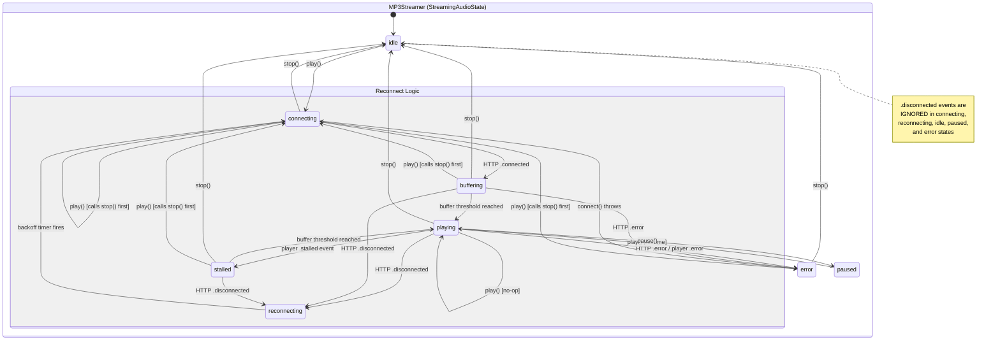
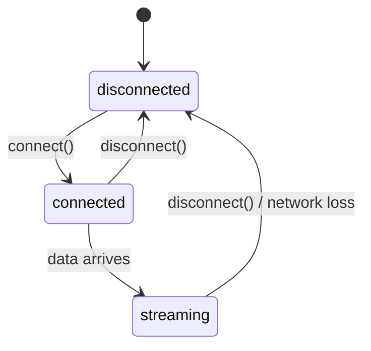
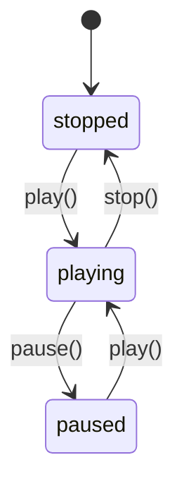
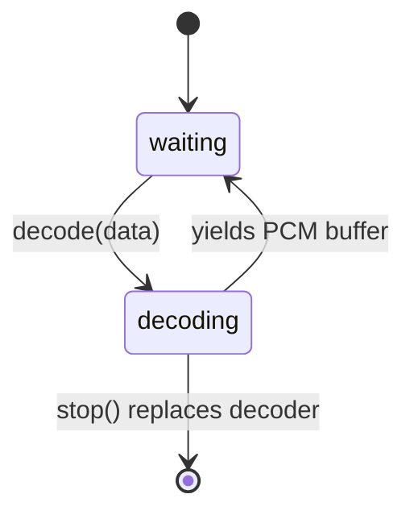
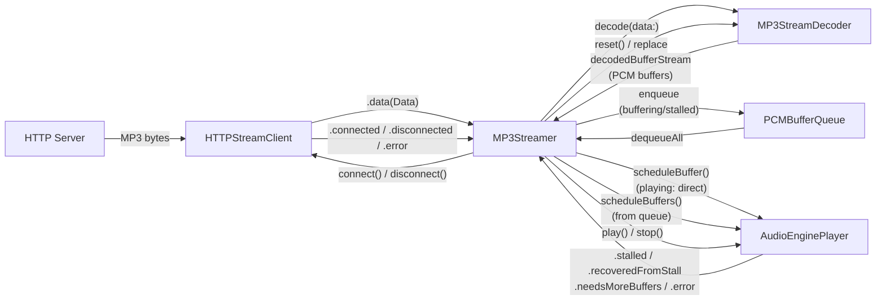
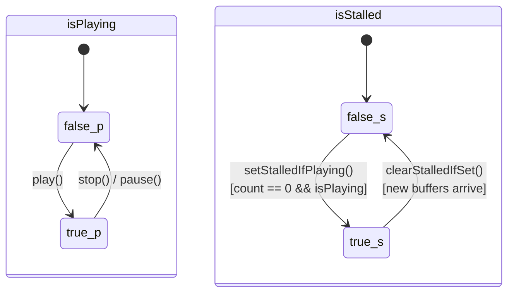
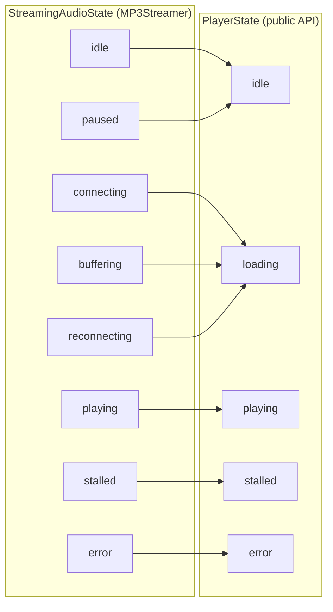

# MP3Streamer State Machine

How the streamer, HTTP client, decoder, and audio player interact.

## Component Interaction

## HTTP Client Events

Events emitted: `.connected`, `.data(Data)`, `.disconnected`, `.error(Error)`

## Audio Engine Player

`stop()` sets `isPlaying = false` before draining the scheduling queue via `schedulingQueue.sync {}`, then calls `playerNode.stop()` inside that sync block. The `scheduleBuffers()` async block guards on `isPlaying` as defense-in-depth.

Events emitted: `.started`, `.stopped`, `.paused`, `.stalled`, `.recoveredFromStall`, `.needsMoreBuffers`, `.error(Error)`

## Decoder Lifecycle

On `stop()`, the decoder is replaced with a fresh instance. The old decoder's `deinit` calls `bufferContinuation.finish()`, terminating its `AsyncStream` and discarding up to 32 stale PCM buffers.

## Data Flow

## PlayerStateBox (AudioEnginePlayer internal)

Thread-safe atomic state inside `AudioEnginePlayer` that drives stall detection and the scheduling queue guard.

The `stop()` sequence depends on this ordering:
1. `stateBox.isPlaying = false` -- in-flight scheduling blocks see this immediately
2. `schedulingQueue.sync { playerNode.stop() }` -- drains queue, then clears buffers
3. `scheduleBuffers()` guards on `stateBox.isPlaying` as defense-in-depth

## State Mapping

`StreamingAudioState` (internal, 9 cases) is projected to `PlayerState` (public, 5 cases) for consumers.

## Reconnect Guard

The `.disconnected` handler only triggers `attemptReconnect()` from these states:

| State | Reconnect? | Reason |
|-------|-----------|--------|
| `.playing` | Yes | Unexpected disconnect during playback |
| `.buffering` | Yes | Connection lost while buffering |
| `.stalled` | Yes | Connection lost while stalled |
| `.connecting` | No | Stale event from stop()/play() cycle |
| `.reconnecting` | No | Already reconnecting |
| `.idle` | No | Intentional stop |
| `.paused` | No | User paused |
| `.error` | No | Already in error handling |
